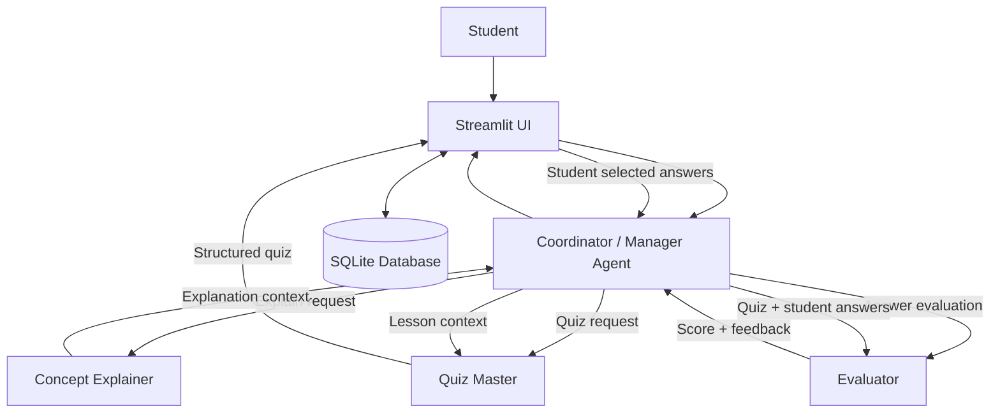

# 🎓 Leo — Multi-Agent AI Tutor

Leo is a **multi-agent AI study assistant** built with **CrewAI** and **Streamlit**. Instead of relying on one general-purpose assistant, Leo uses a team of specialist AI agents coordinated by a manager agent.

A student can interact with Leo naturally, for example:

- `Explain photosynthesis to me as a beginner.`
- `Quiz me on Python loops.`
- `Explain recursion and then give me 5 questions.`
- `Give me harder questions on the topic.`
- Submit quiz answers using clickable options and receive evaluator feedback.

The **Coordinator Agent** decides which specialist agent or agents should handle each request, making Leo a true multi-agent tutoring workflow rather than a collection of isolated prompts.

---

## 📸 Screenshots


### Login Screen


### Main Chat / Tutor Screen


### Clickable Quiz


### Evaluation / Feedback


## ✨ Main Features

- **Multi-agent tutoring with CrewAI**
- **Hierarchical manager orchestration**
- **Coordinator-driven delegation**
- Dedicated **Explainer**, **Quiz Master**, and **Evaluator** agents
- Natural-language student requests through a Streamlit chat interface
- Dynamic behavior based on student intent
- Clickable multiple-choice quiz answers
- Student login / identification
- Persistent SQLite learning history
- Previous-topic and learning-memory support
- Quiz and evaluation storage
- Structured quiz output
- Student answer evaluation and feedback
- Human-in-the-loop interaction between quiz generation and evaluation
- OpenRouter-based LLM access using a Mistral model
- API keys stored securely in `.env`

---

## 🤖 Agent Team

Leo contains four main agents.

### 🧠 Coordinator

The Coordinator is the **manager agent**.

Responsibilities:

- Understand the student's request
- Decide which specialist agent is needed
- Delegate work to the correct agent
- Coordinate multi-agent workflows
- Avoid calling unnecessary agents
- Handle requests involving multiple agents in the correct order
- Use relevant student memory when available

Example:

```text
Student: "Explain recursion and then quiz me."

Coordinator
   ↓
Explainer
   ↓
Quiz Master
```

### 📘 Concept Explainer

Responsibilities:

- Teach concepts clearly
- Adapt explanations to the student's level
- Use simple language and examples
- Focus only on teaching and explanation

### 📝 Quiz Master

Responsibilities:

- Create practice questions
- Generate structured multiple-choice quizzes
- Create questions from the topic or previous explanation
- Produce answer keys for internal evaluation

The Streamlit UI converts structured quiz output into clickable answer options.

### ✅ Student Answer Evaluator

Responsibilities:

- Evaluate student answers
- Identify correct and incorrect responses
- Explain mistakes
- Provide feedback
- Report the student's score
- Identify weak areas for future study

---

## 🏗️ Architecture

Leo uses CrewAI's **hierarchical process**.



The manager is configured using:

```python
process=Process.hierarchical
manager_agent=coordinator
```

The Coordinator is kept separate from the specialist `agents` list so CrewAI can use it correctly as the hierarchical manager.

---

## 🔄 Real Agent Handoffs

Leo is designed so specialist agents do not operate as completely isolated outputs.

### Explanation → Quiz

When a student asks:

```text
Explain photosynthesis and then quiz me.
```

The intended flow is:

```text
Student Request
      ↓
Coordinator
      ↓
Concept Explainer
      ↓
Explanation / lesson context
      ↓
Coordinator
      ↓
Quiz Master
      ↓
Structured Quiz
```

### Quiz → Evaluator

After the Quiz Master creates a quiz, the student selects answers in the UI.

```text
Quiz Master
    ↓
Structured Quiz
    ↓
Student selects answers
    ↓
Coordinator
    ↓
Evaluator
    ↓
Score + feedback
```

This creates an explicit human-in-the-loop stage between quiz generation and evaluation.

---

## 🧠 Memory

Leo uses **SQLite** to persist student learning information.

Stored information includes:

- Student identity
- Username
- Learning level
- Study sessions
- Topic
- Generated quizzes
- Student answers
- Scores
- Evaluator feedback
- Weak areas

The application can retrieve previous learning history and provide relevant context to the Coordinator.

Example:

```text
Student: Sam
Last topic: Photosynthesis
Previous score: 3/5
Weak area: Calvin cycle
```

This allows Leo to support future personalization instead of treating every session as completely new.

---

## 💬 Example Student Requests

### Explanation only

```text
Explain Newton's laws to me at a beginner level.
```

Expected routing:

```text
Coordinator → Explainer
```

### Quiz only

```text
Give me a 5-question quiz on Python loops.
```

Expected routing:

```text
Coordinator → Quiz Master
```

### Explanation + Quiz

```text
Explain photosynthesis and then give me 5 questions.
```

Expected routing:

```text
Coordinator → Explainer → Quiz Master
```

### Evaluation

The student selects answers from the Streamlit quiz interface and presses **Submit Quiz**.

Expected routing:

```text
Quiz + Student Answers → Coordinator → Evaluator
```

---

## 🖱️ Clickable Quiz UI

When the Quiz Master generates a quiz, Leo expects structured quiz data similar to:

```json
{
  "topic": "Photosynthesis",
  "questions": [
    {
      "question_number": 1,
      "question": "Which pigment absorbs light energy in plants?",
      "options": {
        "A": "Hemoglobin",
        "B": "Chlorophyll",
        "C": "Insulin",
        "D": "Keratin"
      },
      "correct_answer": "B"
    }
  ]
}
```

Streamlit renders the options as clickable radio buttons. The student does not need to manually type answers such as `1:B, 2:C`.

---

## 📁 Project Structure

Based on the current project structure:

```text
LEO/
│
├── data/
│   └── leo.db                 # Local SQLite database (generated at runtime)
│
├── src/
│   ├── __init__.py
│   ├── agents.py              # CrewAI agent definitions
│   ├── database.py            # SQLite persistence and student memory
│   ├── llm.py                 # LLM / OpenRouter configuration
│   ├── models.py              # Pydantic structured-output models
│   └── tasks.py               # CrewAI task definitions
│
├── .env                       # API keys - DO NOT COMMIT
├── .gitignore
├── app.py                     # Streamlit user interface
├── requirements.txt           # Python dependencies
├── test_crew.py               # Crew / agent workflow testing
└── test.py                    # Additional testing / experiments
```

`venv/`, `__pycache__/`, `.env`, and local database files should not be committed to GitHub.

---

## 🛠️ Tech Stack

| Technology | Purpose |
|---|---|
| Python | Main programming language |
| CrewAI | Multi-agent framework and orchestration |
| Streamlit | Interactive web interface |
| SQLite | Persistent student memory and history |
| Pydantic | Structured data validation |
| OpenRouter | LLM API gateway |
| Mistral | Underlying language model |
| python-dotenv | Environment variable loading |

---

## ⚙️ Installation

### 1. Clone the repository

```bash
git clone https://github.com/YOUR_USERNAME/leo-ai-tutor.git
cd leo-ai-tutor
```

### 2. Create a virtual environment

On Windows:

```bash
python -m venv venv
venv\Scripts\activate
```

On macOS/Linux:

```bash
python3 -m venv venv
source venv/bin/activate
```

### 3. Install dependencies

```bash
pip install -r requirements.txt
```

---

## 🔐 Environment Variables

Create a `.env` file in the project root:

```env
OPENROUTER_API_KEY=your_openrouter_api_key_here
```

Do **not** upload `.env` to GitHub.

Your `.gitignore` should include entries such as:

```gitignore
.env
venv/
__pycache__/
*.pyc
data/
*.db
*.sqlite
*.sqlite3
```

---

## ▶️ Run Leo

Start the Streamlit application:

```bash
streamlit run app.py
```

Streamlit will open Leo in your browser.

---

## 👤 Student Login Flow

A student enters:

- Username
- Name
- Learning level

For example:

```text
Username: sam123
Name: Sam
Level: Beginner
```

If the username does not already exist, Leo creates a new student record.

If it already exists, Leo loads the existing student and their previous learning history.

> Note: the current login system is intended for student identification in this project. It is not production-grade password authentication.

---

## 🗃️ Database Design

Leo currently uses four main SQLite tables.

### `students`

Stores student information.

```text
id
username
name
level
```

### `sessions`

Stores each learning session.

```text
id
student_id
topic
created_at
```

### `quizzes`

Stores generated quiz data.

```text
id
session_id
quiz_json
created_at
```

### `evaluations`

Stores student answers and feedback.

```text
id
quiz_id
student_answers
score
feedback
weak_areas
created_at
```

Relationship:

```text
Student
  └── Session
       └── Quiz
            └── Evaluation
```

---

## 🧩 Requirement Mapping

| Project Requirement | Leo Implementation |
|---|---|
| CrewAI or AutoGen | CrewAI |
| 4+ distinct roles | Coordinator, Explainer, Quiz Master, Evaluator |
| Real agent delegation | Coordinator delegates to specialists |
| Agent handoffs | Explanation can feed Quiz Master; quiz + answers feed Evaluator |
| Clear orchestration | CrewAI hierarchical manager process |
| Memory | SQLite student/session/history database |
| Prompt per role | Agent-specific role, goal, and backstory/prompt configuration |
| Structured quiz output | JSON/Pydantic-oriented quiz structure |
| Human interaction | Student selects quiz answers before evaluation |
| User interface | Streamlit chat application |
| API-key security | `.env` file excluded from Git |

---

## 🧪 Testing

The repository includes test scripts for running the agent workflow outside Streamlit.

Example:

```bash
python test_crew.py
```

This is useful for testing:

- Coordinator delegation
- Agent behavior
- CrewAI hierarchical orchestration
- Quiz generation
- Evaluation logic
- Database integration

---


